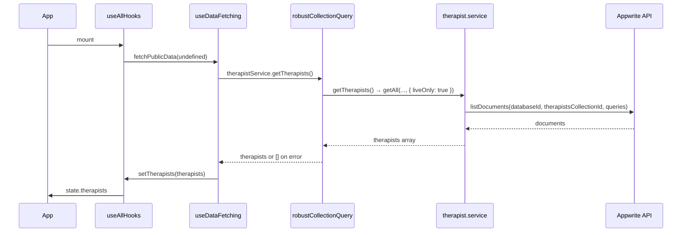

# Appwrite Therapist Live Display Audit

This document explains why therapists from Appwrite may not display live on the app and how to fix it.

## Data flow (where therapists come from)

- **Entry point:** [useAllHooks.ts](src/hooks/useAllHooks.ts) calls `fetchPublicData(undefined)` on mount.
- **Fetch:** [useDataFetching.ts](src/hooks/useDataFetching.ts) calls `robustCollectionQuery(() => therapistService.getTherapists(...), 'therapists', [])`.
- **Service:** [therapist.service.ts](src/lib/appwrite/services/therapist.service.ts) uses **lib/appwrite/config.ts** (not appwrite.config.ts) for `APPWRITE_CONFIG.databaseId` and `APPWRITE_CONFIG.collections.therapists`.
- **Important:** If the Appwrite call throws or times out, `robustCollectionQuery` returns `[]` and only logs a warning, so the app can show zero therapists without an obvious error.

## Root causes (checklist)

### 1. Wrong or placeholder therapists collection ID (most common)

- **Config source:** [src/lib/appwrite/config.ts](src/lib/appwrite/config.ts)  
  `therapists: requireEnv('VITE_THERAPISTS_COLLECTION_ID', 'therapists_collection_id')`
- **Problem:** If `VITE_THERAPISTS_COLLECTION_ID` is not set in `.env`, the app uses the literal `therapists_collection_id`, which is a **placeholder**. Your real Appwrite collection usually has a different ID (often a long hex string).
- **Fix:**
  1. Open [Appwrite Console](https://syd.cloud.appwrite.io/console) → your project → Databases → your database.
  2. Open the **therapists** collection and copy its **Collection ID** (from URL or header).
  3. In project root `.env` add or set:
     - `VITE_THERAPISTS_COLLECTION_ID=<paste the exact collection ID>`
  4. Restart the dev server so Vite picks up the new env.

### 2. Filter step hiding all therapists

- **Location:** [therapist.service.ts](src/lib/appwrite/services/therapist.service.ts) (around lines 122–142).
- **Behaviour:** `VITE_THERAPIST_FILTER_STEP` controls which filters are applied when `liveOnly: true`:
  - `0` (default): only `Query.limit(200)` — no approved/status/availability filters.
  - `1`: also `approved = true`.
  - `2`: also `status = 'online'`.
  - `3`: also `availability = 'available'`.
- **Problem:** If step is 1, 2, or 3 but no documents have the required attributes/values, the list is empty.
- **Fix:**
  - To see everyone (for debugging): ensure `VITE_THERAPIST_FILTER_STEP` is unset or `0`.
  - For production: ensure therapist documents in Appwrite have the correct attributes and values (e.g. `approved` boolean, `status` and `availability` strings) and that step matches your schema.

### 3. Read permissions on the therapists collection

- **Problem:** If the collection does not allow read for “Any” (or the role your client uses), Appwrite returns 401 and the service throws; the app then shows no therapists (see “Errors become empty list” below).
- **Fix:** In Appwrite Console → therapists collection → Settings → Permissions: add **Read** for role **Any** (or the appropriate role).

### 4. Errors turned into empty list (silent failure)

- **Location:** [robustApiWrapper.ts](src/lib/robustApiWrapper.ts) — `robustCollectionQuery` catches errors and returns the fallback (e.g. `[]`).
- **Problem:** Any failure (wrong collection ID, 401, timeout, network) results in zero therapists and only a console warning, e.g.  
  `[robustCollectionQuery] therapists collection query returned null (error or timeout). Using fallback.`
- **Fix:** Run the in-app audit (see below) and check the browser console for that warning and any preceding error. Fix the underlying cause (collection ID, permissions, or network).

### 5. City filter returning 0 (when city is passed)

- **Relevant when:** `fetchPublicData(activeCity)` is called with a city (e.g. from URL or selection).
- **Behaviour:** [therapist.service.ts](src/lib/appwrite/services/therapist.service.ts) adds `Query.equal('locationId', primaryCity)` and `Query.equal('country', 'Indonesia')`. If no documents have matching `locationId`/`country`, the list is empty; there is a client-side fallback using `primary_city`/`city` when the server query returns 0.
- **Fix:** Ensure therapist documents have `locationId` (or the field your app uses) and `country` set correctly, or rely on the client-side city filter by passing `undefined` when you want “all” (e.g. on initial load, as in useAllHooks).

## How to run the audit in the app

1. Start the app (e.g. `npm run dev`).
2. Open the Appwrite Diagnostic page (e.g. route `/appwrite-diagnostic` or your app’s link to it).
3. Click **“Audit Therapist Live Display”**.
4. Read the log:
   - It shows the **database ID** and **therapists collection ID** actually used (from [lib/appwrite/config.ts](src/lib/appwrite/config.ts)).
   - It reports whether `VITE_THERAPISTS_COLLECTION_ID` is set.
   - It shows `VITE_THERAPIST_FILTER_STEP` and which filters apply.
   - It runs a small `listDocuments(..., limit 5)` and reports success/failure and document count.
   - On error, it suggests fixes (e.g. set env, fix permissions).

Use this to confirm the correct collection ID, permissions, and filter step so that therapists from Appwrite display live.

## Quick checklist

| Check | Action |
|-------|--------|
| Collection ID | Set `VITE_THERAPISTS_COLLECTION_ID` in `.env` to the **exact** ID from Appwrite Console (not `therapists_collection_id`). |
| Filter step | Use `VITE_THERAPIST_FILTER_STEP=0` to debug; then set 1/2/3 only when documents have the right attributes. |
| Permissions | Therapists collection: Read for “Any” (or your client role). |
| Console | After load, check for `[robustCollectionQuery] therapists ... returned null` and fix the underlying error. |
| Diagnostic | Use “Audit Therapist Live Display” on the Appwrite Diagnostic page to verify config and listDocuments. |

## Related files

- Therapist fetch: [src/lib/appwrite/services/therapist.service.ts](src/lib/appwrite/services/therapist.service.ts)
- Config used by therapist service: [src/lib/appwrite/config.ts](src/lib/appwrite/config.ts)
- Public data fetch: [src/hooks/useDataFetching.ts](src/hooks/useDataFetching.ts)
- Init and state: [src/hooks/useAllHooks.ts](src/hooks/useAllHooks.ts)
- Error handling (returns [] on failure): [src/lib/robustApiWrapper.ts](src/lib/robustApiWrapper.ts)
- Troubleshooting (publish button / isLive): [docs/THERAPIST_PUBLISH_TROUBLESHOOTING.md](THERAPIST_PUBLISH_TROUBLESHOOTING.md)
