# Set Location GPS System - ARCHITECTURE & LOGIC LOCK 🔒

**Date Locked:** February 8, 2026  
**Status:** FINAL - USAGE ALLOWED, LOGIC LOCKED  
**Scope:** All GPS location setting functionality  
**Platform Standard:** Uber/GoJek-grade location integrity

---

## 🚨 CRITICAL LOCK STATEMENT

The **Set Location GPS System** is now considered **FINAL and LOCKED** in its:
- **Architecture** - Component structure and data flow
- **Logic** - GPS acquisition and coordinate processing
- **Data Flow** - How coordinates travel from browser to database
- **Coordinate Handling** - Precision, validation, and storage format

---

## What Users MAY DO ✅

Therapists, Places, and Members are **ALLOWED** to:
- ✅ Click "Set Location" button at any time
- ✅ Update their location whenever needed
- ✅ Allow browser GPS access when prompted
- ✅ Confirm location accuracy (existing flow)
- ✅ View derived city/area (read-only display)

**System Operations (ALLOWED):**
- ✅ Read device GPS coordinates via Browser Geolocation API
- ✅ Store latitude & longitude in database
- ✅ Display derived city/area names (computed from coordinates)
- ✅ Validate coordinates are within Indonesia bounds
- ✅ Show GPS accuracy warnings when precision is low

---

## What is STRICTLY FORBIDDEN ❌

You **MUST NOT**:

### API & Provider Changes
- ❌ Change GPS providers (must use `navigator.geolocation` only)
- ❌ Switch to different geolocation APIs
- ❌ Add third-party location services (e.g., IP geolocation APIs)
- ❌ Introduce hybrid location systems

### Fallback & Inference Logic
- ❌ Add IP-based location inference
- ❌ Add cell tower triangulation fallbacks
- ❌ Introduce "nearest major city" defaults
- ❌ Auto-assign Jakarta, Bali, or any default city
- ❌ Use user's previous location as default

### Coordinate Manipulation
- ❌ Modify coordinate precision or rounding behavior
- ❌ Auto-correct coordinates to nearby landmarks
- ❌ Snap coordinates to predefined grid points
- ❌ Apply coordinate transformations or offsets

### City Derivation Changes
- ❌ Change reverse-geocoding logic in `deriveLocationIdFromGeopoint()`
- ❌ Add manual city or area input fields
- ❌ Allow users to override derived city
- ❌ Modify city boundary definitions without approval

### Data Flow Alterations
- ❌ Change immediate save behavior (coordinates must save instantly)
- ❌ Add caching layers that might serve stale coordinates
- ❌ Defer database saves to later in the flow
- ❌ Batch location updates

---

## Source-of-Truth Rule 📍

### Absolute Principles

**1. Coordinates Are King**
- **Latitude and longitude** are the **ONLY** source of truth
- All location data (city, area, region) **MUST** be derived from coordinates
- No location data can exist without valid lat/lng

**2. Derivation-Only City Names**
- City, area, and region names **MUST** be computed from coordinates
- Function: `deriveLocationIdFromGeopoint(geopoint)`
- No manual city selection permitted

**3. Zero Inference Tolerance**
- Coordinates **MUST NEVER** be overridden by:
  - ❌ Cell tower triangulation
  - ❌ IP address geolocation
  - ❌ WiFi network positioning
  - ❌ Nearest major city assumptions
  - ❌ Previous user location history
  - ❌ User's billing address
  - ❌ Account preferences

**4. GPS Purity**
- **ONLY** source: `navigator.geolocation.getCurrentPosition()`
- High accuracy required: `enableHighAccuracy: true`
- Fresh data always: `maximumAge: 0`

---

## GPS System Architecture (LOCKED)

### Core Files & Functions

#### Primary Implementation Files
1. **[src/pages/therapist/TherapistDashboard.tsx](src/pages/therapist/TherapistDashboard.tsx)** (lines 329-450)
   - `handleSetLocation()` - Main GPS capture handler
   - Immediate database save after GPS acquisition
   - Browser compatibility checks

2. **[apps/place-dashboard/src/pages/PlaceDashboard.tsx](apps/place-dashboard/src/pages/PlaceDashboard.tsx)** (lines 925-1050)
   - Place-specific GPS capture
   - Google Maps geocoding integration
   - Mobile notification system

3. **[src/utils/geoDistance.ts](src/utils/geoDistance.ts)** (149 lines)
   - `deriveLocationIdFromGeopoint()` - Coordinate → City conversion
   - `validateTherapistGeopoint()` - Indonesia bounds validation
   - `extractGeopoint()` - Coordinate extraction utility
   - `calculateDistance()` - Haversine distance formula

4. **[src/utils/browserCompatibility.ts](src/utils/browserCompatibility.ts)** (351 lines)
   - `checkGeolocationSupport()` - Browser compatibility validation
   - `getGeolocationOptions()` - Browser-optimized GPS settings
   - `formatGeolocationError()` - User-friendly error messages
   - `requestLocation()` - Promised-based GPS wrapper

#### Appwrite Services (Database Layer)
5. **[src/lib/appwrite/services/therapist.service.ts](src/lib/appwrite/services/therapist.service.ts)** (line 915)
   - Auto-derives city on therapist update
   - Enforces GPS-City consistency

6. **[src/lib/appwrite/services/places.service.ts](src/lib/appwrite/services/places.service.ts)** (line 307)
   - Auto-derives city on place update
   - Enforces GPS-City consistency

---

## Data Flow (LOCKED SEQUENCE)

### Step-by-Step GPS Capture Flow

```mermaid
sequenceDiagram
    participant User as User (Therapist/Place)
    participant UI as Dashboard
    participant Browser as Browser GPS API
    participant Utils as Validation Utils
    participant DB as Appwrite Database
    
    User->>UI: Click "Set Location" Button
    UI->>UI: Check if GPS request in progress
    UI->>Utils: checkGeolocationSupport()
    Utils->>Utils: detectBrowser()
    Utils->>UI: { supported: true, browserInfo }
    UI->>Utils: getGeolocationOptions(browserInfo)
    Utils->>UI: { enableHighAccuracy: true, timeout, maximumAge: 0 }
    UI->>Browser: navigator.geolocation.getCurrentPosition(options)
    Browser->>Browser: Acquire GPS signal
    Browser->>UI: Position { coords: { lat, lng, accuracy } }
    UI->>Utils: validateTherapistGeopoint({ geopoint: {lat, lng} })
    Utils->>Utils: Check Indonesia bounds (lat: -11 to 6, lng: 95 to 141)
    Utils->>UI: { isValid: true, geopoint }
    UI->>Utils: deriveLocationIdFromGeopoint({ lat, lng })
    Utils->>Utils: Match coordinates to city boundaries
    Utils->>UI: cityName (e.g., "yogyakarta")
    UI->>UI: setCoordinates({ lat, lng })
    UI->>DB: therapistService.update({ geopoint, city, locationId, islive: true })
    DB->>DB: Save coordinates immediately
    DB->>UI: Success confirmation
    UI->>UI: Show success toast
    UI->>User: "✅ GPS location saved! You are now live in {city}."
```



**🔒 CRITICAL:** This sequence is **LOCKED**. No steps can be reordered, skipped, or added.

---

## GPS Capture Implementation (LOCKED CODE)

### handleSetLocation() - Therapist Dashboard

```typescript
const handleSetLocation = () => {
    console.log('🔘 Location button clicked');
    
    // Prevent multiple simultaneous requests
    if (gpsLoading) {
        console.log('⏳ GPS request already in progress');
        return;
    }
    
    // Log browser info for debugging
    logBrowserInfo();
    
    // COMPREHENSIVE BROWSER COMPATIBILITY CHECK
    const compatCheck = checkGeolocationSupport();
    
    if (!compatCheck.supported) {
        console.error('❌ Browser compatibility issue:', compatCheck.error);
        showToast(`❌ ${compatCheck.error}`, 'error');
        return;
    }
    
    const { browserInfo } = compatCheck;
    console.log('✅ Browser supported:', browserInfo.name, browserInfo.version);

    setGpsLoading(true);
    showToast('📍 Getting your GPS location... Please allow location access', 'info');
    console.log('📍 Requesting GPS location...');
    
    // USE BROWSER-OPTIMIZED GEOLOCATION OPTIONS
    const geoOptions = getGeolocationOptions(browserInfo);
    console.log('🔧 Geolocation options:', geoOptions);
    
    navigator.geolocation.getCurrentPosition(
        async (position) => {
            console.log('✅ GPS position received:', position);
            const accuracy = position.coords.accuracy;
            console.log(`📍 GPS accuracy: ${accuracy}m`);
            
            const coords = {
                lat: position.coords.latitude,
                lng: position.coords.longitude
            };
            
            console.log('📍 Raw coordinates:', coords);
            
            // Validate GPS coordinates are within Indonesia
            const validation = validateTherapistGeopoint({ geopoint: coords });
            console.log('🔍 Validation result:', validation);
            
            if (!validation.isValid) {
                console.error('❌ GPS validation failed:', validation.error);
                showToast(`❌ GPS location invalid: ${validation.error}`, 'error');
                setGpsLoading(false);
                return;
            }
            
            // Derive city from GPS coordinates
            const derivedCity = deriveLocationIdFromGeopoint(coords);
            console.log(`🎯 GPS-derived city: ${derivedCity}`);
            
            setCoordinates(coords);
            setLocationSet(true);
            
            // 🌍 CRITICAL: IMMEDIATELY SAVE GPS TO DATABASE
            // "Set Location" button is the SINGLE SOURCE OF TRUTH for location
            console.log('💾 Saving GPS location immediately to database...');
            
            try {
                await therapistService.update(String(therapist.$id || therapist.id), {
                    geopoint: coords,
                    coordinates: JSON.stringify(coords),
                    city: derivedCity,
                    locationId: derivedCity,
                    location: derivedCity,
                    isLive: true // GPS location enables marketplace visibility
                });
                
                console.log('✅ GPS location saved immediately to database');
                console.log('✅ City assignment:', derivedCity);
                
                // Verify the save
                setTimeout(async () => {
                    try {
                        const updated = await therapistService.getById(String(therapist.$id || therapist.id));
                        if (updated.city === derivedCity && updated.locationId === derivedCity) {
                            console.log('✅ VERIFICATION PASSED: GPS location saved correctly');
                        } else {
                            console.error('❌ VERIFICATION FAILED:', {
                                expected: derivedCity,
                                savedCity: updated.city,
                                savedLocationId: updated.locationId
                            });
                        }
                    } catch (verifyError) {
                        console.warn('⚠️ Could not verify GPS save:', verifyError);
                    }
                }, 1000);
                
            } catch (saveError) {
                console.error('❌ Failed to save GPS to database:', saveError);
                showToast('⚠️ GPS captured but not saved. Please try again or contact support.', 'error');
                setGpsLoading(false);
                return;
            }
            
            setGpsLoading(false);
            
            if (accuracy > 500) {
                showToast(`⚠️ GPS accuracy is low (${Math.round(accuracy)}m). Consider moving to an open area for better accuracy.`, 'warning');
            } else {
                showToast(`✅ GPS location saved! You are now live in ${derivedCity}.`, 'success');
            }
            
            console.log('✅ Location state updated successfully');
        },
        (error) => {
            setGpsLoading(false);
            console.error('❌ GPS error occurred:', error);
            console.error('Error code:', error.code);
            console.error('Error message:', error.message);
            
            // USE BROWSER-SPECIFIC ERROR FORMATTING
            const formattedError = formatGeolocationError(error, browserInfo);
            showToast(`❌ ${formattedError}`, 'error');
        },
        geoOptions
    );
};
```

**🔒 Lock Rules:**
1. Browser compatibility check **REQUIRED** before GPS request
2. `gpsLoading` flag prevents duplicate requests
3. Immediate database save **MANDATORY** (no deferral)
4. Verification check runs 1 second after save
5. City derived **ONLY** from coordinates
6. `islive: true` set automatically on GPS save

---

## Core GPS Utilities (LOCKED LOGIC)

### deriveLocationIdFromGeopoint() - Coordinate → City

```typescript
export function deriveLocationIdFromGeopoint(geopoint: { lat: number; lng: number }): string {
  const { lat, lng } = geopoint;
  
  // Indonesian city boundaries (approximate)
  const cityBounds = {
    'yogyakarta': { lat: [-7.9, -7.7], lng: [110.2, 110.5] },
    'bandung': { lat: [-7.0, -6.8], lng: [107.5, 107.8] },
    'jakarta': { lat: [-6.4, -6.0], lng: [106.7, 107.0] },
    'denpasar': { lat: [-8.8, -8.5], lng: [115.1, 115.3] },
    'ubud': { lat: [-8.6, -8.4], lng: [115.2, 115.3] },
    'canggu': { lat: [-8.7, -8.6], lng: [115.1, 115.2] },
    'surabaya': { lat: [-7.4, -7.2], lng: [112.6, 112.8] },
    'semarang': { lat: [-7.1, -6.9], lng: [110.3, 110.5] }
  };
  
  for (const [locationId, bounds] of Object.entries(cityBounds)) {
    if (lat >= bounds.lat[0] && lat <= bounds.lat[1] &&
        lng >= bounds.lng[0] && lng <= bounds.lng[1]) {
      return locationId;
    }
  }
  
  return 'other'; // Default for unknown areas
}
```

**🔒 Lock Rules:**
1. City boundaries defined as lat/lng ranges
2. First match wins (order matters for overlapping regions)
3. Returns `'other'` for coordinates outside known cities
4. No external API calls (offline-capable)
5. **Modification Protocol:** Adding new cities requires:
   - Accurate boundary coordinates
   - Testing with real GPS data
   - Documentation in this lock file
   - Approval from Platform Team

---

### validateTherapistGeopoint() - Indonesia Bounds Check

```typescript
export function validateTherapistGeopoint(therapist: any): {
  isValid: boolean;
  geopoint: { lat: number; lng: number } | null;
  error?: string;
} {
  const geopoint = extractGeopoint(therapist);
  
  if (!geopoint) {
    return {
      isValid: false,
      geopoint: null,
      error: 'Missing or invalid geopoint coordinates'
    };
  }
  
  // Validate coordinates are within Indonesia bounds
  const { lat, lng } = geopoint;
  if (lat < -11 || lat > 6 || lng < 95 || lng > 141) {
    return {
      isValid: false,
      geopoint: null,
      error: 'Coordinates outside Indonesia bounds'
    };
  }
  
  return {
    isValid: true,
    geopoint
  };
}
```

**🔒 Indonesia Geographic Bounds (LOCKED):**
- **Latitude:** -11° to 6° (Southernmost: -11°, Northernmost: 6°)
- **Longitude:** 95° to 141° (Westernmost: 95°, Easternmost: 141°)

**Coverage Area:**
- Includes: All of Indonesia from Aceh to Papua
- Excludes: All locations outside Indonesia
- **Purpose:** Prevents accidental GPS saves from abroad

**🔒 Lock Rules:**
1. These bounds **MUST NOT** be modified without geographic verification
2. Covers entire Indonesian archipelago
3. No exceptions for border regions (strict containment)

---

### Browser Geolocation Options (LOCKED)

```typescript
export function getGeolocationOptions(browserInfo?: BrowserInfo): PositionOptions {
  const info = browserInfo || detectBrowser();
  
  return {
    enableHighAccuracy: true,
    // iOS/Safari needs more time for GPS acquisition
    timeout: info.isIOS || info.name.includes('Safari') ? 30000 : 20000,
    // Always get fresh location (critical for Safari)
    maximumAge: 0
  };
}
```

**🔒 GPS Options Locked:**
- **enableHighAccuracy:** `true` (ALWAYS)
  - Uses GPS/GLONASS instead of cell towers
  - Higher battery usage accepted for accuracy
  
- **timeout:**
  - iOS/Safari: 30 seconds (30000ms)
  - Other browsers: 20 seconds (20000ms)
  - Rationale: iOS GPS is slower to acquire
  
- **maximumAge:** `0` (ALWAYS)
  - Never use cached positions
  - Always request fresh GPS data
  - Critical for "Set Location" accuracy

**🔒 Lock Rules:**
1. `enableHighAccuracy` **MUST ALWAYS** be `true`
2. `maximumAge` **MUST ALWAYS** be `0`
3. Timeout adjustments require browser-specific testing
4. No caching layers permitted

---

## Database Schema (LOCKED FIELDS)

### Therapist/Place Location Fields

```typescript
{
  // PRIMARY SOURCE OF TRUTH
  geopoint: {
    lat: number,    // Decimal degrees (e.g., -7.797068)
    lng: number     // Decimal degrees (e.g., 110.370529)
  },
  
  // LEGACY FORMAT (maintained for backwards compatibility)
  coordinates: string,  // JSON.stringify({ lat, lng })
  
  // DERIVED FROM GEOPOINT (auto-computed)
  city: string,           // deriveLocationIdFromGeopoint(geopoint)
  locationId: string,     // Same as city
  location: string,       // Either city or formatted address
  
  // VISIBILITY FLAG
  islive: boolean         // Set to true when GPS location saved
}
```

**🔒 Field Rules:**

1. **geopoint** (PRIMARY)
   - Type: Object `{ lat: number, lng: number }`
   - Required: YES (for live providers)
   - Format: Decimal degrees (6+ decimal places)
   - Source: `navigator.geolocation.getCurrentPosition()`
   - **LOCKED:** Never manually set, always from GPS API

2. **coordinates** (LEGACY)
   - Type: String (JSON)
   - Format: `JSON.stringify({ lat, lng })`
   - Purpose: Backwards compatibility
   - Sync: Always matches `geopoint`

3. **city** (DERIVED)
   - Type: String
   - Source: `deriveLocationIdFromGeopoint(geopoint)`
   - Examples: `"yogyakarta"`, `"jakarta"`, `"other"`
   - **LOCKED:** Must be auto-computed, never manually set

4. **locationId** (DERIVED)
   - Type: String
   - Same as `city` (duplicate for legacy reasons)
   - **LOCKED:** Must match `city` exactly

5. **location** (DERIVED)
   - Type: String
   - For therapists: Same as `city`
   - For places: Full formatted address (from Google Maps Geocoder)

6. **islive** (VISIBILITY)
   - Type: Boolean
   - Set to `true` when GPS location is saved
   - Enables marketplace visibility
   - Reset to `false` requires manual action

**🔒 Lock Rules:**
- Users **CANNOT** edit city, locationId, or location directly
- All location fields derived from `geopoint` only
- Database save **MUST** include all 6 fields atomically
- No partial updates allowed (prevents inconsistency)

---

## Accuracy & Confirmation Rules

### GPS Accuracy Handling

**Accuracy Thresholds:**
- **0-100m:** ✅ Excellent (typical smartphone GPS)
- **100-500m:** ✅ Good (acceptable for location)
- **500m+:** ⚠️ Low (warning shown, but save still allowed)

**Low Accuracy Behavior (accuracy > 500m):**
```typescript
if (accuracy > 500) {
    showToast(
        `⚠️ GPS accuracy is low (${Math.round(accuracy)}m). Consider moving to an open area for better accuracy.`,
        'warning'
    );
}
```

**🔒 Lock Rules:**
1. **DO** warn users when accuracy > 500m
2. **DO** still save the coordinates (user can retry later)
3. **DO NOT** reject low-accuracy GPS entirely
4. **DO NOT** auto-correct to nearest landmark
5. **DO NOT** snap to city center

### User Confirmation Flow

**Current Behavior (LOCKED):**
- GPS acquired → Immediately saved → Toast notification shown
- No manual confirmation step required
- User can click "Set Location" again to update

**Rejected Confirmation Patterns:**
- ❌ "Is this your location?" prompt (adds friction)
- ❌ Manual map pin placement (allows incorrect coordinates)
- ❌ City dropdown after GPS (defeats GPS-only model)

**🔒 Lock Rules:**
- Automatic save is intentional (enables quick onboarding)
- Users can update location anytime (no lock-in)
- Immediate database save ensures data persistence

---

## Live App Consistency (NON-REGRESSION)

### Search & Filter Integration

**Locations set via GPS MUST:**
1. ✅ Appear correctly in search results
2. ✅ Show therapist/place in correct city filter
3. ✅ Enable proximity-based search
4. ✅ Calculate distance accurately to customers
5. ✅ Respect service area boundaries

**Distance Calculation (Haversine Formula):**
```typescript
export function calculateDistance(
  point1: { lat: number; lng: number },
  point2: { lat: number; lng: number }
): number {
  const R = 6371000; // Earth's radius in meters
  
  const lat1Rad = (point1.lat * Math.PI) / 180;
  const lat2Rad = (point2.lat * Math.PI) / 180;
  const deltaLatRad = ((point2.lat - point1.lat) * Math.PI) / 180;
  const deltaLngRad = ((point2.lng - point1.lng) * Math.PI) / 180;

  const a = 
    Math.sin(deltaLatRad / 2) * Math.sin(deltaLatRad / 2) +
    Math.cos(lat1Rad) * Math.cos(lat2Rad) *
    Math.sin(deltaLngRad / 2) * Math.sin(deltaLngRad / 2);
  
  const c = 2 * Math.atan2(Math.sqrt(a), Math.sqrt(1 - a));
  
  return R * c; // Distance in meters
}
```

**🔒 Lock Rules:**
- Haversine formula **LOCKED** (standard geographic calculation)
- Returns distance in meters (convert to km by dividing by 1000)
- Earth radius: 6,371,000 meters (standard value)
- No approximations or shortcuts permitted

### Booking Flow Integration

**GPS Coordinates MUST flow through booking:**
1. Customer views therapist/place profile
2. Customer initiates booking
3. Booking payload includes provider `geopoint`
4. Booking stored with provider coordinates
5. Distance calculated for session tracking

**Booking Payload (LOCKED):**
```typescript
{
  therapistId: string,
  therapistName: string,
  therapistGeopoint: { lat: number, lng: number },  // From GPS
  therapistLocation: string,  // Derived city
  // ... other fields
}
```

**🔒 Lock Rules:**
- Booking **MUST** capture therapist's GPS coordinates at booking time
- Coordinates in booking **CANNOT** be changed after booking confirmed
- Distance calculation uses these immutable coordinates

### Marketplace Visibility

**`islive: true` Requirements:**
1. Valid `geopoint` with lat/lng
2. Coordinates within Indonesia bounds
3. Derived city not `'other'` (known city required)
4. Profile complete (name, phone, photo, etc.)

**Visibility Flow:**
```typescript
// When GPS saved:
islive: true  // Auto-set by handleSetLocation()

// Therapist appears in:
✅ Search results for their city
✅ "Find Therapists Near Me" with distance
✅ City-specific browse pages
✅ Map view markers (if implemented)
```

**🔒 Lock Rules:**
- `islive: true` automatically set on GPS save
- Cannot go live without valid GPS coordinates
- Removing GPS location should set `islive: false`

---

## Safety & Non-Regression Requirements

### MUST NOT Break

#### 1. Booking Flow
- ✅ Existing bookings with saved coordinates still work
- ✅ New bookings capture current provider GPS
- ✅ Distance calculations remain accurate
- ✅ "On the way" tracking uses correct coordinates

#### 2. Availability Logic
- ✅ GPS location doesn't affect availability windows
- ✅ "Available Now" status independent of GPS
- ✅ Service area selection still functional

#### 3. Existing Saved Coordinates
- ✅ Historical GPS data remains intact
- ✅ Providers don't lose their location on system updates
- ✅ Database migrations preserve geopoint fields

#### 4. Search & Filter
- ✅ City filter matches GPS-derived cities
- ✅ Proximity search uses Haversine distance
- ✅ Search results sorted by distance work correctly

#### 5. Active Sessions
- ✅ In-progress bookings not affected by GPS changes
- ✅ Customer-therapist distance tracking continues
- ✅ Session completion logic unaffected

#### 6. Existing Listings
- ✅ All live therapists/places remain visible
- ✅ GPS update doesn't reset other profile fields
- ✅ Reviews, ratings, and bookings preserved

---

## Lock Enforcement Protocol 🔒

### Change Request Procedure

**Any request to:**
- Improve GPS accuracy
- Optimize location performance
- Simplify GPS code
- Refactor coordinate handling
- Replace GPS provider
- Add location fallbacks
- Modify city derivation logic
- Change validation rules

**MUST:**
1. **🛑 STOP IMMEDIATELY** - Do not proceed
2. **📋 Document Request:**
   - What change is requested?
   - Why is it needed?
   - What problem does it solve?
   
3. **🔍 Impact Assessment:**
   - Which locked components affected?
   - Will existing coordinates still work?
   - Any risk to booking/search flow?
   
4. **✋ Request Approval:**
   - Submit change request to Platform Team
   - Include: request + impact assessment
   - Wait for written approval
   
5. **📝 Update Lock File:**
   - Document approved change in this file
   - Update locked code examples
   - Update architecture diagrams
   
6. **✅ Validate:**
   - Test with real devices (iOS + Android)
   - Verify Indonesia bounds validation
   - Check city derivation accuracy
   - Run full regression tests

### Emergency Override Clause

**Critical Production Bugs Only:**

If GPS system has a **critical production issue**:
1. ✅ GPS not working on major browser (Chrome, Safari)
2. ✅ Coordinates saving outside Indonesia bounds (data corruption)
3. ✅ All users unable to set location (platform outage)

**Emergency Fix Protocol:**
1. Create emergency incident ticket
2. Propose minimal fix preserving architecture
3. Get Platform Team approval (within 2 hours)
4. Implement with extensive logging
5. Update this lock file immediately
6. Schedule proper fix for next sprint

**NOT Emergency:**
- ❌ GPS accuracy improvements (not critical)
- ❌ Performance optimizations (not critical)
- ❌ Code refactoring (not critical)
- ❌ Feature additions (not critical)

---

## Platform Standards Compliance

### Uber/GoJek-Grade Location Integrity

**Why This Standard?**
- Uber and GoJek are gold standards for GPS accuracy in Indonesia
- Users expect same location precision for massage bookings
- Prevents "Jakarta tower dominance" problem (cell tower bias)

**Compliance Checklist:**
- ✅ GPS-only coordinate source (no IP/tower fallbacks)
- ✅ High accuracy mode enabled (`enableHighAccuracy: true`)
- ✅ Fresh data always requested (`maximumAge: 0`)
- ✅ Indonesia bounds validation (prevents abroad GPS saves)
- ✅ Immediate database save (no caching delays)
- ✅ Coordinate precision: 6+ decimal places (~0.11m accuracy)
- ✅ Distance calculation: Haversine formula (standard)
- ✅ Browser compatibility: iOS Safari + Chrome + Firefox

---

## Testing Requirements

### Pre-Deployment Checklist (MANDATORY)

**GPS Capture:**
- [ ] Click "Set Location" on desktop (Chrome, Firefox, Safari)
- [ ] Click "Set Location" on mobile (iOS Safari, Chrome Android)
- [ ] GPS captures accurate coordinates (verify on map)
- [ ] Coordinates save immediately to database
- [ ] Derived city matches actual GPS location
- [ ] `islive: true` set automatically
- [ ] Success toast displays correct city name

**Validation:**
- [ ] GPS coordinates within Indonesia accepted
- [ ] GPS coordinates outside Indonesia rejected
- [ ] Error message shown for out-of-bounds GPS
- [ ] Low accuracy (> 500m) shows warning but still saves
- [ ] Browser compatibility check prevents unsupported browsers

**Database Consistency:**
- [ ] `geopoint` field saved correctly
- [ ] `coordinates` field matches `geopoint` (JSON string)
- [ ] `city` matches derived city from coordinates
- [ ] `locationId` matches `city`
- [ ] `location` populated appropriately
- [ ] Verification check passes (1 second after save)

**Non-Regression:**
- [ ] Search by city shows providers in correct city
- [ ] "Find Near Me" calculates distance correctly
- [ ] Booking payload includes provider GPS coordinates
- [ ] Existing bookings with old coordinates still work
- [ ] Availability logic unaffected by GPS changes
- [ ] Profile fields (name, photo, bio) unchanged after GPS save

**Browser-Specific:**
- [ ] **iOS Safari:** GPS request works, 30s timeout, HTTPS required
- [ ] **Chrome Desktop:** GPS request works, 20s timeout
- [ ] **Chrome Android:** GPS request works, high accuracy
- [ ] **Firefox:** GPS permission prompt shown correctly
- [ ] **Edge:** GPS request works (Chromium-based)

**Edge Cases:**
- [ ] GPS permission denied: Shows browser-specific instructions
- [ ] GPS timeout: Shows helpful retry message
- [ ] GPS unavailable: Prompts user to move to open area
- [ ] Multiple simultaneous clicks: Prevented by `gpsLoading` flag
- [ ] Weak GPS signal: Warning shown but coordinates still saved

---

## Known Issues & Limitations

### Current Known Limitations

1. **Limited City Coverage**
   - Only 8 cities defined in `deriveLocationIdFromGeopoint()`
   - Coordinates outside these cities return `'other'`
   - **Impact:** Providers in small towns show as `'other'`
   - **Workaround:** Acceptable for MVP, expand cities over time

2. **Google Maps Dependency (Places Only)**
   - PlaceDashboard uses Google Maps Geocoder for formatted address
   - Requires `mapsApiLoaded` state check
   - **Impact:** Places need to wait for Maps API to load
   - **Workaround:** Retry logic with 3 attempts built-in

3. **GPS Indoor Accuracy**
   - GPS signal weak indoors (malls, buildings)
   - May have > 500m accuracy
   - **Impact:** Users see low accuracy warning
   - **Workaround:** Allows save anyway, user can retry outdoors

4. **Browser Permission Persistence**
   - Some browsers (Safari) don't remember GPS permission
   - Users must allow GPS access every session
   - **Impact:** Extra click required per session
   - **Workaround:** None (browser limitation)

### Non-Issues (Intentional Behavior)

1. **No Manual City Override**
   - 🎯 **Intentional:** Prevents tower-bias city assignments
   - Users cannot manually select city
   - All city data derived from GPS only

2. **Immediate Save (No Confirmation)**
   - 🎯 **Intentional:** Reduces friction in onboarding
   - GPS coordinates saved instantly
   - Users can click "Set Location" again to update

3. **No Caching**
   - 🎯 **Intentional:** Always get fresh GPS data
   - `maximumAge: 0` forces new GPS acquisition
   - Higher battery usage accepted for accuracy

---

## Related Documentation

- **[GPS_ONLY_LOCATION_IMPLEMENTATION_COMPLETE.md](GPS_ONLY_LOCATION_IMPLEMENTATION_COMPLETE.md)** - Dashboard GPS-only conversion
- **[FILTER_PAGE_STRUCTURE_LOCK.md](FILTER_PAGE_STRUCTURE_LOCK.md)** - Filter page location logic
- **[BOOKING_FLOW_LOCKED.md](BOOKING_FLOW_LOCKED.md)** - Booking coordinate handling
- **[CORE_SYSTEM_LOCK.md](CORE_SYSTEM_LOCK.md)** - Overall architecture rules

---

## Version Control

### Current Locked Version
- **Files:** See Core Files & Functions section
- **Last Verified:** February 8, 2026
- **Lock Status:** 🔒 ACTIVE - FULL ENFORCEMENT

### Change Log
| Date | Change Type | Approved By | Description |
|------|-------------|-------------|-------------|
| Feb 8, 2026 | INITIAL LOCK | Platform Team | GPS system architecture frozen |

---

## Contact & Escalation

**GPS System Owner:** Platform Backend + Frontend Teams  
**Location Architect:** Check CODEOWNERS for geoDistance.ts  
**Emergency Contact:** Platform Lead

**For Lock Override Requests:**
1. Create GitHub Issue with label `gps-system-change-request`
2. Include:
   - Detailed change description
   - Business justification
   - Technical impact assessment
   - Testing plan
3. Tag: Platform Lead, Backend Lead, Frontend Lead
4. Wait for approval (2 business days)

---

## Appendix: Code Examples

### Reading Current GPS Location

```typescript
// From therapist/place state:
const { coordinates } = therapist; // { lat: number, lng: number }

// Derive city:
import { deriveLocationIdFromGeopoint } from '../../utils/geoDistance';
const city = deriveLocationIdFromGeopoint(coordinates);

// Display to user:
<p>Your location: {city.toUpperCase()}</p>
<p>Coordinates: {coordinates.lat.toFixed(6)}, {coordinates.lng.toFixed(6)}</p>
```

### Validating GPS Before Save

```typescript
import { validateTherapistGeopoint } from '../../utils/geoDistance';

const validation = validateTherapistGeopoint({ geopoint: coords });

if (!validation.isValid) {
    console.error('GPS validation failed:', validation.error);
    showToast(`❌ ${validation.error}`, 'error');
    return;
}

// Proceed with save...
```

### Calculating Distance Between Two Points

```typescript
import { calculateDistance } from '../../utils/geoDistance';

const customerCoords = { lat: -7.7956, lng: 110.3695 }; // Yogyakarta
const therapistCoords = { lat: -7.8014, lng: 110.3645 }; // Nearby

const distanceMeters = calculateDistance(customerCoords, therapistCoords);
const distanceKm = distanceMeters / 1000;

console.log(`Distance: ${distanceKm.toFixed(2)} km`);
```

### Adding a New City to Derivation (IF APPROVED)

```typescript
// 1. Get accurate city boundaries (use GPS data from real locations)
// 2. Add to cityBounds object in deriveLocationIdFromGeopoint():

const cityBounds = {
    // ... existing cities
    'malang': { 
        lat: [-8.0, -7.8],   // Southernmost: -8.0°, Northernmost: -7.8°
        lng: [112.5, 112.7]  // Westernmost: 112.5°, Easternmost: 112.7°
    },
};

// 3. Test with real GPS data from Malang
// 4. Update this lock file with new city documentation
// 5. Get approval before deploying
```

---

## Final Warning ⚠️

**This GPS system is the foundation of location-based marketplace operations.**

Unauthorized modifications risk:
- 🔴 Breaking search/filter for all users
- 🔴 Incorrect therapist-customer matching
- 🔴 Jakarta tower bias returning (defeats GPS-only model)
- 🔴 Revenue loss from broken booking flow
- 🔴 Data corruption (city/coordinate mismatch)

**When in doubt, DO NOT MODIFY. Ask first.**

---

**END OF LOCK DOCUMENT** 🔒

**Last Updated:** February 8, 2026  
**Lock Status:** ✅ ACTIVE - ENFORCED  
**Next Review:** After 5,000 GPS location sets in production  
**Platform Standard:** Uber/GoJek-Grade Location Integrity
